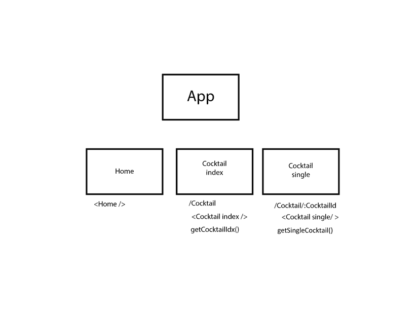
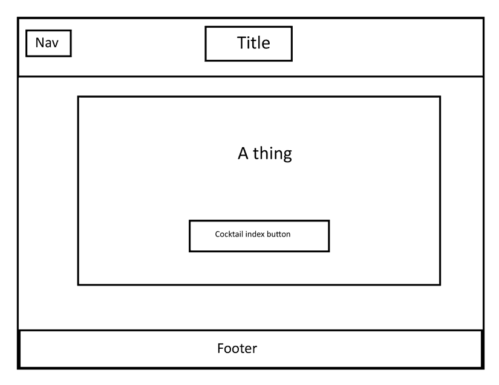
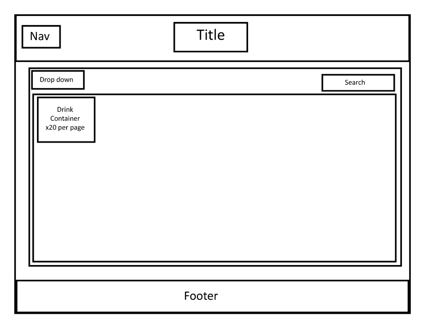
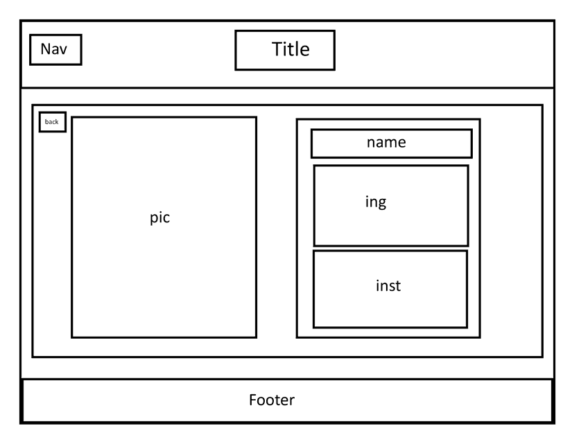

# API project

## Description

The purpose of this project was to create a webpage that displays information from an API in a multi page format using react.

## Deployment link

Please find the website at the following link: 
https://dapper-tipples.netlify.app/

## Getting Started/Code Installation

This code is hosted on netlify. Please follow the link provided.

## Timeframe & Working Team

The timeframe of this code was 2 days. Wednesday the 22nd at 12pm of November to the 24th at 1pm. This project was a collabaration between Benedict Norton and Alfred Shaw.

## Technologies Used

Technologies used are as follows:
<li>VS code</li>
<li>Photoshop</li>
<li>Netlify</li>
<li>Firefox</li>

Packages for VS code used are as follows:
<li>React</li>
<li>React router dom</li>
<li>React bootstrap</li>
<li>Bootstrap</li>
<li>Sass</li>

## Brief

This project is to practice using react and APIs. We needed to find an API to extract data from, and then using the react framework, create a functional website that displays all the data on the page.

Requirements:
<li>Create a working application hosted on the internet.</li>
<li>The application must make use of an API and process the data is some way.</li>

## Planning

For this project, we decided to use a cocktail database API. Tasks were split between us, with each of us taking a position we felt confident in. I was in charge of the logic, accesing formatting and displaying API data, and creating the functional navigation of the site using react router dom. Benedict was in charge of the styling, the footer and header contents and a nav bar for navigating the site.

THIS READ ME IS FOR ALFRED SHAW, THIS MEANS THAT ALL PARTS MENTIONED ARE SECTIONS WORKED ON BY HIM. FOR THE SECTIONS DONE BY BENEDICT NORTON, PLEASE SEE HIS READ ME FOR THE SAME PROJECT.

### Wireframe:

The first step in planning was generating a wireframe for the front end of the website. The wireframe consists of the different pages that were represented by layers on photoshop. The frame was as follows:

### Pseudocode:

Due to the simple nature of this program, and the framework used, the pseudo code for this was not very long. Most of the structure used in this project is known modules and functions already built into the framework being used:

    //use react router dom for page navigation.
    //use Sass for styling.

    //6 components for the site:

    //-Header
    //nav bar, logo and site name
    //static

    //-Footer
    //copyright cool duo (:
    //static

    //-Home page
    //Welcome page, image and some text

    //-Index page
    //List of all cocktails
    //Random cocktails button
    //Filter cocktails by alcohol type
    //Display all cocktails neatly in page
    //Inset scroll page or pages
    //When pressing on a cocktail, get taken to the individual page

    //-Single display page
    //Display all useful information about cocktail
    //List ingredients and measurments
    //Show instructions
    //Back button to go back to cocktail index

    //-Error page
    //Why are you here? Go away!
    //Link back to home page

    //loader.js for api

## Build/Code Process

The main code is made up of several different files. We have a .jsx for every componenet on the page:

<li>CocktailIdx.jsx</li>
<li>CocktailSgl.jsx</li>
<li>Footer.jsx</li>
<li>Header.jsx</li>
<li>Home.jsx</li>
<li>NotFound.jsx</li>
<li>Sidebar.jsx</li>

All of the functionality for the application is contained in these functions. The way the code functions is by referencing these jsx files in a main file, and then displaying them using react-router-dom on the page relative the the navigation state.

**The loader:**

The loader is a part of code that returns the data from the APIs for quick access for the index page and the single page. (it was not used on the filter as there were some bugs, but the filter API loader could be incorporated into here). There is not much else to it, but it is required to see where API data is loaded from on the main pages.

The code:

    export async function getCocktailIndex() {
      const res = await fetch('https://thecocktaildb.com/api/json/v1/1/filter.php?c=Cocktail')
      return res.json()
    }

    export async function getCocktailSingle(id) {
      const res = await fetch(`https://thecocktaildb.com/api/json/v1/1/lookup.php?i=${id}`)
      return res.json()
    }

**The Cocktail index page:**

The index page uses the API to load in a brief list of the cocktails available to the user. The API we used had some functionality held back under a paid subscription, but it still functions, just with less items than actually available.
My aim for this project was to make the API data access as light as possible, so this application only makes a single request at a time to the API, and it will referance data it already has if it can as opposed to reloading the API several times. The code on this page loads the API through the loader.js that is shown above.

The code:

    import { useLoaderData, Link } from 'react-router-dom'
    import { useEffect, useState } from 'react'

    //Bootstrap
    import Col from 'react-bootstrap/Col'
    import Container from 'react-bootstrap/Container'

    export default function CocktailList() {
      
      const allDrinks = useLoaderData()

      //States
      const [spirit, setSpirit] = useState('All')
      const [cocktails, setCocktails] = useState(allDrinks)
      const [idList, setIdList] = useState([])
      const [idRnd, setidRnd] = useState(0)

      //Functions
      function handleChange(e){
        setSpirit(e.target.value)
      }

      //Effects
      useEffect(() => {
        const ids = allDrinks.drinks.map(cocktail => {
          return cocktail.idDrink
        })
        setIdList(ids)
      }, [allDrinks.drinks])

      useEffect(() => {
        async function filterBySpirit(){
          try {
            if (spirit !== 'All') {
              const res = await fetch(`https://thecocktaildb.com/api/json/v1/1/filter.php?i=${spirit}`)
              const data = await res.json()
              setCocktails(data)
            }
            else setCocktails(allDrinks)
          } catch (error) {
            console.log(error)
          }
        }
        filterBySpirit()
    }, [spirit, allDrinks])

      useEffect(() => {
        const i = Math.floor(Math.random()*idList.length)
        setidRnd(idList[i])
      }, [idList])

      return (
        <>
          

            <select name="spiritSelect" onChange={handleChange}>
              <option value="All">All</option>
              <option value="Bourbon">Bourbon</option>
              <option value="Brandy">Brandy</option>
              <option value="Gin">Gin</option>
              <option value="Rum">Rum</option>
              <option value="Tequila">Tequila</option>
              <option value="Vodka">Vodka</option>
              <option value="Whiskey">Whiskey</option>
            </select>
            <h1>Cocktail list</h1>
            <Link to={`/cocktails/${idRnd}`} className="randomBtn">Random cocktail</Link>
          

          <Container fluid className='cocktailList overflow-auto'>
            { cocktails.drinks.map(cocktail => {
              const { idDrink, strDrink, strDrinkThumb } = cocktail
            return (
              <Col
              key = {idDrink}
              as={Link}
              style={ { backgroundImage: `url(${strDrinkThumb})` } }
              to={`/cocktails/${idDrink}`}
              >
                
{strDrink}

              </Col>
            )
            })}
          </Container>
        </>
      )
    }

**The single Cocktail page:**

For 

The code:

    import { useLoaderData, Link } from 'react-router-dom'
    import { useEffect, useState } from 'react'

    export default function CocktailSingle() {
      
      const cocktails = useLoaderData()
      const cocktailDetails = cocktails.drinks[0]
      const { strDrink, strInstructions, strDrinkThumb} = cocktailDetails

      const [ ingList, setIngList] = useState([])

      useEffect(() => {
        const ings = []
          for (let i=1; i<16; i++) {
            let ing = `strIngredient${i}`
            let meas = `strMeasure${i}`
            if (cocktailDetails[ing] !== null){
              ings.push({
                ingredient: cocktailDetails[ing],
                measure: cocktailDetails[meas]
              })
            }
          }
        setIngList(ings)
      }, [cocktailDetails, cocktails.drinks])

      return (
        <>
          

            <h1>{ strDrink }</h1>
            <Link to={`/cocktails`} className="backBtn">Back</Link>
          

          

            
            

              <ul>
                {ingList.map((item, idx) =>{
                  if (item.measure !== null)
                    return <li key={idx}>{item.measure} {item.ingredient}</li>
                  else return <li key={idx}>{item.ingredient}</li>
                })
                }
              </ul>
              
{ strInstructions }

            

          

        </>
      )
    }

This

**The page template:**

This part of code allows the framework for loading the jsx files when needed. This is constantly shown on the page, and parts are refreshed and replaced on page naviation, instead of reloading the entire webpage. Here, we have a permenant header and footer that doesnt change, but we use outlet in the middle. This is used to swap out what is loaded and displayed on the web page from the main loader.

The code:

    import { Outlet } from 'react-router-dom'

    import Header from './components/Header'
    import Footer from './components/Footer'

    function App() {

      return (
        <>
          <Header />
          <main>
            <Outlet />
          </main>
          <Footer />
        </>
      )
    }

    export default App

**The main loader and path system:**

The main loader is used for navigating the page and loading the required content when requested. The react router dom allows us to use this and create paths for the site to follow, as sown in the function. Styling is also applied here, in addition to any code needed to carry over values for page navigation.

The code:

    import ReactDOM from 'react-dom/client'
    import { createBrowserRouter, RouterProvider } from 'react-router-dom'

    // StyleBoyz
    import 'bootstrap/dist/css/bootstrap.min.css'
    import './style/main.scss'

    //Components
    import App from './App.jsx'
    import Home from './components/Home.jsx'
    import CocktailIdx from './components/CocktailIdx.jsx'
    import CocktailSgl from './components/CocktailSgl.jsx'
    import NotFound from './components/NotFound.jsx'

    //Loaders
    import { getCocktailIndex, getCocktailSingle } from './loaders/cocktails.js'

    const router = createBrowserRouter([
      {
        path: '/',
        element:<App />,
        children: [
          {
            path: '/',
            element: <Home />
          },
          {
            path: '/cocktails',
            element: <CocktailIdx />,
            loader: getCocktailIndex
          },
          {
            path: '/cocktails/:cocktailId',
            element: <CocktailSgl />,
            loader: async ({ params }) => getCocktailSingle(params.cocktailId)
          },
          {
            path: '*',
            element: <NotFound />
          },
        ]
      }
    ])

    ReactDOM.createRoot(document.getElementById('root')).render(
      <RouterProvider router={router} />
    )

## Challenges

The main challenge of this project was using the react framework for the first time without support. So far i have a decent understanding of APIs and accessing and using information in them, however using reacts functions instead of javascript proved to be difficult. This is a skill that simply will come with more practice, but did prove to be quite a challenge.
The small timescale of this project also proved to be a challenge, as we were working in pairs on a limited timeline, prepration was light and the whole project needed to be complete quite quickly. With the delegation of tasks needing to take place relatively quickly etc. I believe it was handled well by my partner Benedict and myself, but it was still a challenge to sort, especially as certain aspects needed to be completed before others could be started.

## Wins

I am very happy with the way my APIs are accessed and used. Previously my projects used to call to an API multiple times which i wasnt very fond of. This could cause isses if these APIs had request limits etc, and can also be very slow, calling data for little reason that could simply be accessed with additional logic.
Additionally, the API had some strangely formatted data, which i was able to use some logic for converting data types to get to display in a way i wanted, which i felt proud of. Overall, working with APIs in this project proved to be a win itself.

## Key Learnings/Takeaways

Overall, i learnt alot about using react and its additional packages and features. The framework is very good for making multi page website quickly, and works decently with APIs. Alot of this project was cementing all the features and commands we have covered previously in lectures. My biggest takeaway from this project is that alot of these frameworks work in very specific ways, with no deviation or two ways about doing it, so the best way to use react is by practicing the same things over again with different applications to learn when and why to use certain functions.

## Bugs

1.	The page does display cocktails that may not appear in the All cattegory when sorting by spirit. This is NOT A BUG, NOR AN INTENDED FEATURE, it is infact down the the fact the API used will only give 100 items without using the paid variant at any given request. As this database is quite vast, this means when filtering, as it is a seperate request to the first one (due to the API design), you will get this disparity in drinks.
2.  Some drink descriptions might appear to go off the page. This is a styling issue as not all of the drinks in the API are known to use and we were not aware of how long the descriptions on some of them are.
3.  The drop down nav menu never became functional, so it doesn not work even though it is still in the code for smaller screens.
4.  The styling isnt entirely dynamic.

## Future Improvements

<li>Fixing of all bugs listed above.</li>
<li>Redo of certain styling aspects to allow for a more dynamic experience.</li>
<li>Possibly find a better cocktail API with more relevant information to allow for more website functionality and better use of filters.</li>
<li>Functionality of drop down side nav bar.</li>
<li>Add some extra pages such as information on ingredients etc.</li>

